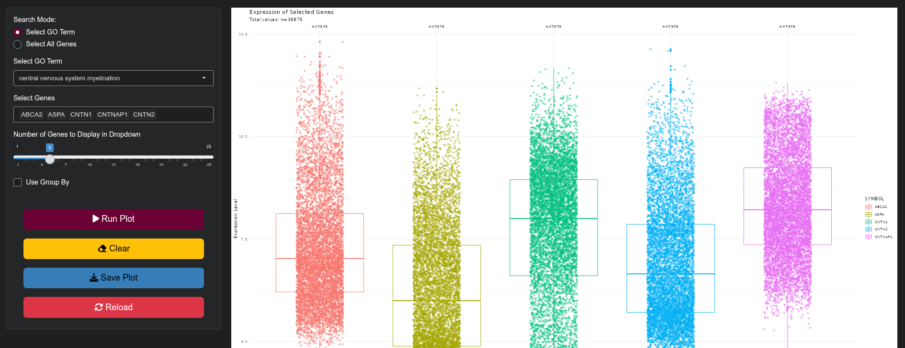
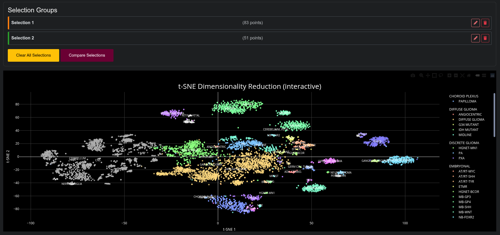
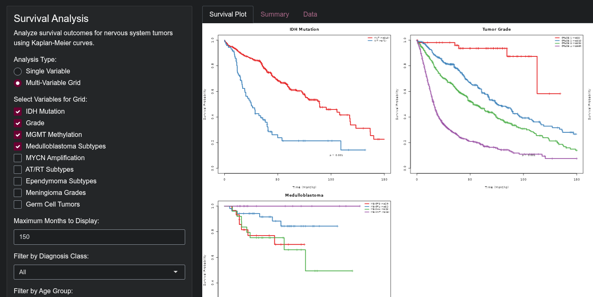
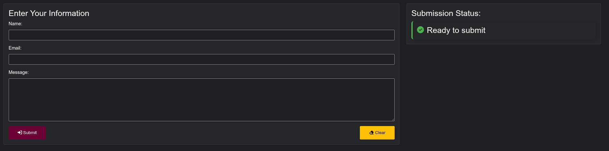

[](# "This app is in beta. Expect frequent updates and improvements as we continue development. Some features may be under construction.")

---

# Transcriptomic Atlas of Nervous System Tumors

This app is designed to explore and analyze a large, annotated transcriptomic atlas of nervous system tumors and non-tumor entities. It provides several main functionalities: mRNA boxplots, dimensionality reduction, and survival analysis.

[](https://kdph.shinyapps.io/atlas/)

## Table of Contents
- [Overview](#overview)
- [Features](#features)
  - [mRNA Boxplots](#1-mrna-boxplots)
  - [Dimensionality Reduction](#2-dimensionality-reduction)
  - [Survival Analysis](#3-survival-analysis)
  - [Contact Form](#4-contact-form)
- [Usage](#usage)
- [Key Findings from the Underlying Dataset](#key-findings-from-the-underlying-dataset)
- [Applications](#applications)
- [Limitations](#limitations)
- [Requirements](#requirements)
- [Installation](#installation)
- [Data Files](#data-files)
- [Contributing](#contributing)
- [License](#license)
- [Citation](#citation)
- [Acknowledgments](#acknowledgments)

## Overview

The underlying dataset consists of 5,402 neoplastic and 1,973 non-neoplastic samples collected from public sources and processed using Applied Biosystems GeneChip for data uniformity. The raw data has been reprocessed, normalized, and harmonized to create a cohesive dataset.

This app draws inspiration from the [glioVis R app](https://kdph.shinyapps.io/GlioVis/) ([GitHub](https://github.com/KentuckyDepartmentForPublicHealth/shiny_GlioVis)) and aims to provide similar functionality for exploring the nervous system tumor atlas.

## Features

### 1. mRNA Boxplots

- Visualize gene expression levels across different tumor types and non-tumor samples
- Compare expression distributions using boxplots
- Search by Gene Ontology (GO) terms or specific genes, with grouping options by variables like diagnosis or sex


<a href="https://kdph.shinyapps.io/atlas/">
  
</a>

### 2. Dimensionality Reduction

- Apply machine learning techniques (FIt-SNE, DBSCAN, OPTICS) to identify clusters by diagnosis
- Visualize high-dimensional data in 2D or 3D space to explore transcriptomic clustering
- Select points to view sample details and compare selections interactively

<a href="https://kdph.shinyapps.io/atlas/">
  
</a>

### 3. Survival Analysis

- Perform Kaplan-Meier survival analysis for different tumor groups
- Investigate the impact of gene expression on survival outcomes
- Compare survival curves across various clinical and molecular subgroups
- Supports single-variable and multi-variable grid analyses with downloadable PDF plots

<a href="https://kdph.shinyapps.io/atlas/">
  
</a>

### 4. Contact Form

- Submit feedback or inquiries to the project team, integrated with Monday.com for submission tracking

<a href="https://kdph.shinyapps.io/atlas/">
  
</a>

## Usage

1. **Data Selection**: Choose the dataset and specific samples to analyze.
2. **Analysis Type**: Select the desired analysis type (mRNA boxplots, dimensionality reduction, or survival analysis).
3. **Parameters**: Adjust parameters specific to each analysis type.
4. **Visualization**: View the results in interactive plots and charts.
5. **Export**: Download results and figures for further analysis or presentation.

## Key Findings from the Underlying Dataset

- Clustering by diagnosis was achieved, with clusters primarily diagnosis-driven.
- DNA methylation's diagnostic uniqueness extends to transcriptomic data across nervous system neoplasms.
- The dataset includes rare tumors, spans all ages, and integrates samples worldwide, supporting broad comparative analyses.

## Applications

- Enables comparative gene expression analysis among nervous system neoplasms.
- Supports diagnostic refinement, especially in cases like pilocytic astrocytoma and ganglioglioma.
- Useful for exploring biological relationships between tumors and healthy tissues.

## Limitations

- Some diagnostic inconsistencies remain due to surrogate variables like geographic origin.
- High classifier accuracy may reflect potential overfitting; not yet suited for clinical application.

## Requirements

- R version 4.0 or higher
- Shiny package
- Additional R packages for specific analyses

## Installation

1. Clone the repository:
   ```
   git clone https://github.com/KentuckyDepartmentForPublicHealth/atlas.git
   ```

2. Install required R packages:
   ```
   install.packages(c(
    "shiny", "bslib", "shinyjs", "shinycssloaders", "DT", "plotly",
    "dplyr", "tidyr", "ggplot2", "survival", "survminer", "forcats",
    "httr", "jsonlite", "shinyalert"))
   ```

3. Run the app:
   ```
   shiny::runApp()
   ```
## Data Files

- geneExpressionData.RData: Contains gene expression data
- atlasDataClean: Dataset with cleaned transcriptomic and clinical metadata
- gene_annotations: Gene annotation data with ENTREZID and SYMBOL
- go_to_genes_list: Mapping of GO terms to genes

Ensure [these files](https://github.com/KentuckyDepartmentForPublicHealth/atlas-data) are placed in the dat/ directory. Following, run the ETL/ Rmd scripts to clean the raw data and generate annotations.

## Contributing

Contributions are welcome! Please fork the repository and submit pull requests with your improvements or new features.

## License

This project is licensed under the MIT License - see the [LICENSE.md](LICENSE.md) file for details.

Copyright (c) 2025 Kentucky Department for Public Health

The MIT License allows you to use, copy, modify, merge, publish, distribute, sublicense, and/or sell copies of this software, subject to including the above copyright notice and permission notice in all copies or substantial portions of the software.

## Citation

> Kentucky Department for Public Health. (2025). Transcriptomic Atlas of Nervous System Tumors.
> Source code: https://github.com/KentuckyDepartmentForPublicHealth/atlas
> Deployed application: https://kdph.shinyapps.io/atlas/

## Acknowledgments

- All researchers and institutions that contributed to the underlying dataset
- [Kentucky Pediatric Cancer Research Trust Fund](https://www.chfs.ky.gov/agencies/dph/dpqi/cdpb/Pages/pcrtf.aspx)
- The glioVis R app for inspiration
